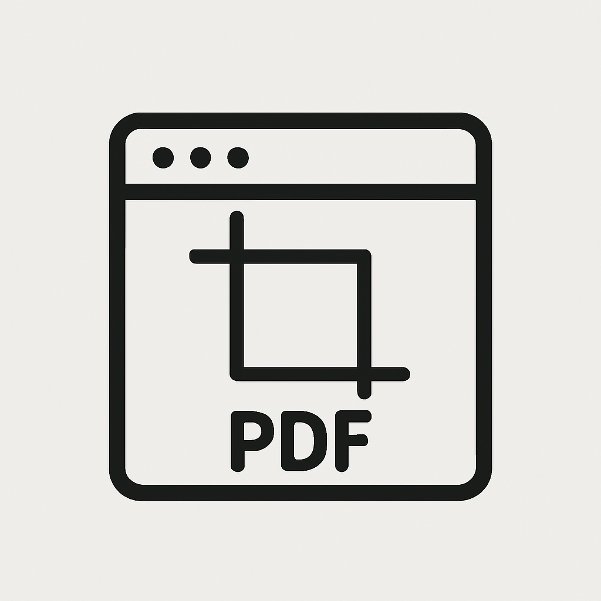

# Screen Capture to PDF (SlideSnap)

A desktop application designed to automatically capture screenshots of a changing screen region and compile them into a PDF. Ideal for capturing presentation slides, tutorials, or any dynamic content.




## Features

*   **Region Selection:** Select any rectangular area on your screen to monitor.
*   **Intelligent Change Detection:** Automatically captures a screenshot only when significant visual changes occur within the selected region (using Mean Squared Error comparison). Avoids redundant captures of static content or minor flickers.
*   **Automatic Capture:** Runs in the background once started.
*   **Start Delay Timer:** Configurable delay (0-10 seconds, default 3) before monitoring begins after clicking "Start".
*   **PDF Compilation:** Automatically compiles captured screenshots into a single PDF upon stopping.
*   **Configurable PDF Layout:**
    *   Choose 1, 2, or 4 images per page (defaults to 4).
    *   Layouts for 2 and 4 images per page use custom page sizes to tightly stitch images together vertically or in a 2x2 grid, respectively.
    *   Layout for 1 image per page uses standard letter size with margins.
*   **Theme Support:** Adapts to your system's theme (Light/Dark) or allows manual selection via the "Appearance" dropdown.
*   **Always on Top:** The control window stays conveniently visible above other applications.
*   **Custom Icon:** Features a distinct application icon.
*   **Searchable PDFs (OCR):** Automatically processes the generated PDF using OCR (Optical Character Recognition) to add a searchable text layer.

## Setup

1.  Ensure you have Python 3.8 or higher installed.
2.  Clone or download this repository.
3.  Navigate to the project directory in your terminal.
4.  Install the required dependencies:
    ```bash
    pip install -r requirements.txt
    ```
5.  **Install OCRmyPDF:** This application uses OCRmyPDF to make PDFs searchable. You need to install it and its dependencies (including the Tesseract OCR engine) separately. On macOS with Homebrew, this is typically:
    ```bash
    brew install ocrmypdf
    ```
    Refer to the [OCRmyPDF documentation](https://ocrmypdf.readthedocs.io/en/latest/installation.html) for other operating systems or installation methods.

## Usage

1.  Run the application from the project directory:
    ```bash
    # On macOS, you might need to specify the Qt plugin path if using Anaconda
    export QT_QPA_PLATFORM_PLUGIN_PATH=/path/to/your/anaconda3/lib/pythonX.Y/site-packages/PyQt6/Qt6/plugins/platforms; python main.py
    # Or simply, if paths are configured correctly:
    python main.py
    ```
    *(Note: Replace the example plugin path with your actual Anaconda path if needed)*

2.  **Select Region:** Click "Select Region" and draw a box around the area you want to monitor. If you click "Start" without selecting a region, the selection tool will open automatically.
3.  **Configure Settings:**
    *   **Appearance:** Choose "System", "Light", or "Dark" theme.
    *   **Timer:** Set the delay (in seconds) before recording starts.
    *   **PDF Settings:**
        *   Enable/disable PDF generation after stopping.
        *   Choose the number of images per page (1, 2, or 4).
        *   Select the output directory for the generated PDF (defaults to Desktop).
4.  **Start:** Click "Start". Monitoring will begin after the configured delay.
5.  **Stop:** Click "Stop" when finished. If PDF generation is enabled, the application will:
    *   Generate the initial PDF with images (showing progress).
    *   Automatically run OCRmyPDF on the generated PDF to add a searchable text layer (showing "Performing OCR..." status).
    *   Save the final, searchable PDF with the prefix "OCR\_" in the same output directory (e.g., `OCR_capture_timestamp.pdf`). The original image-only PDF is deleted upon successful OCR.
